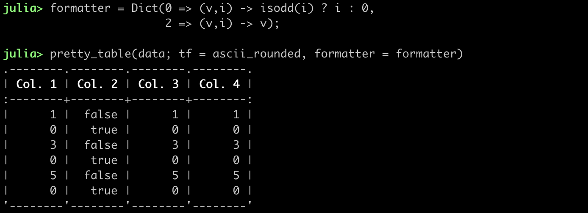
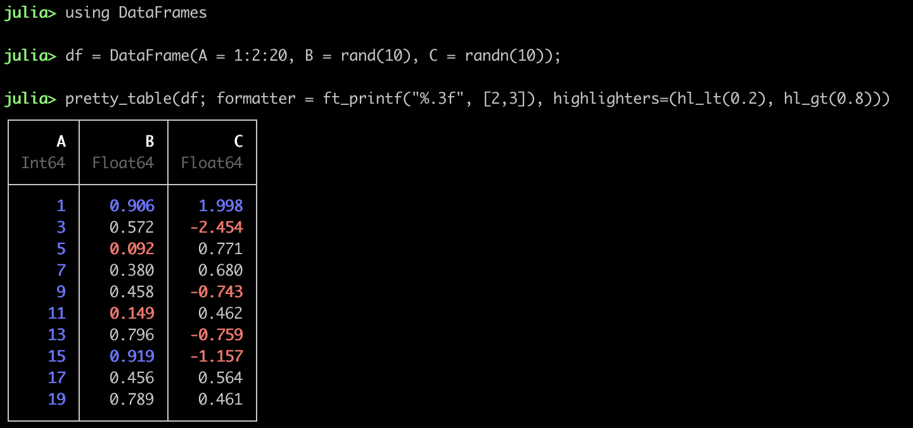
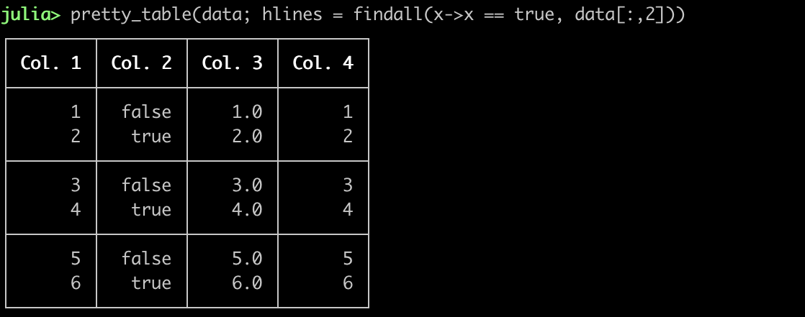
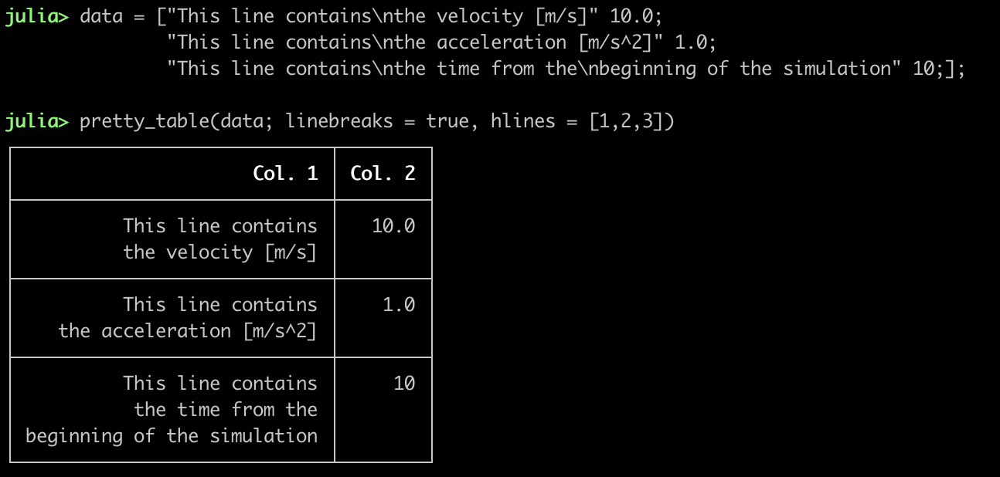
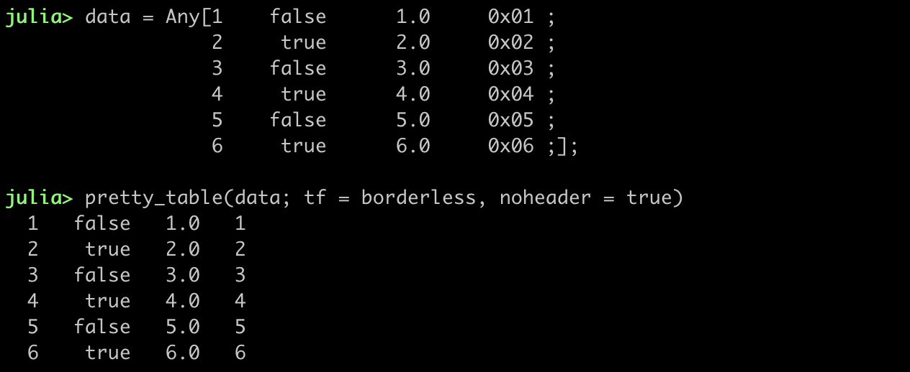
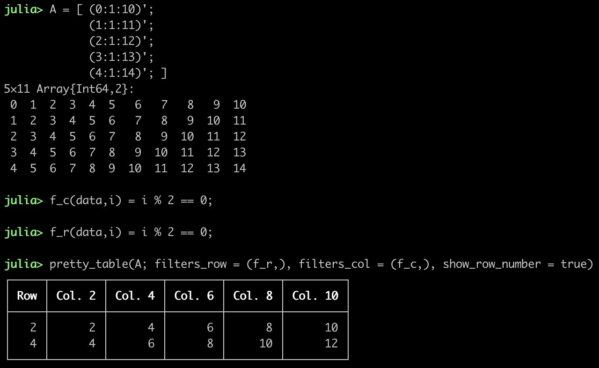
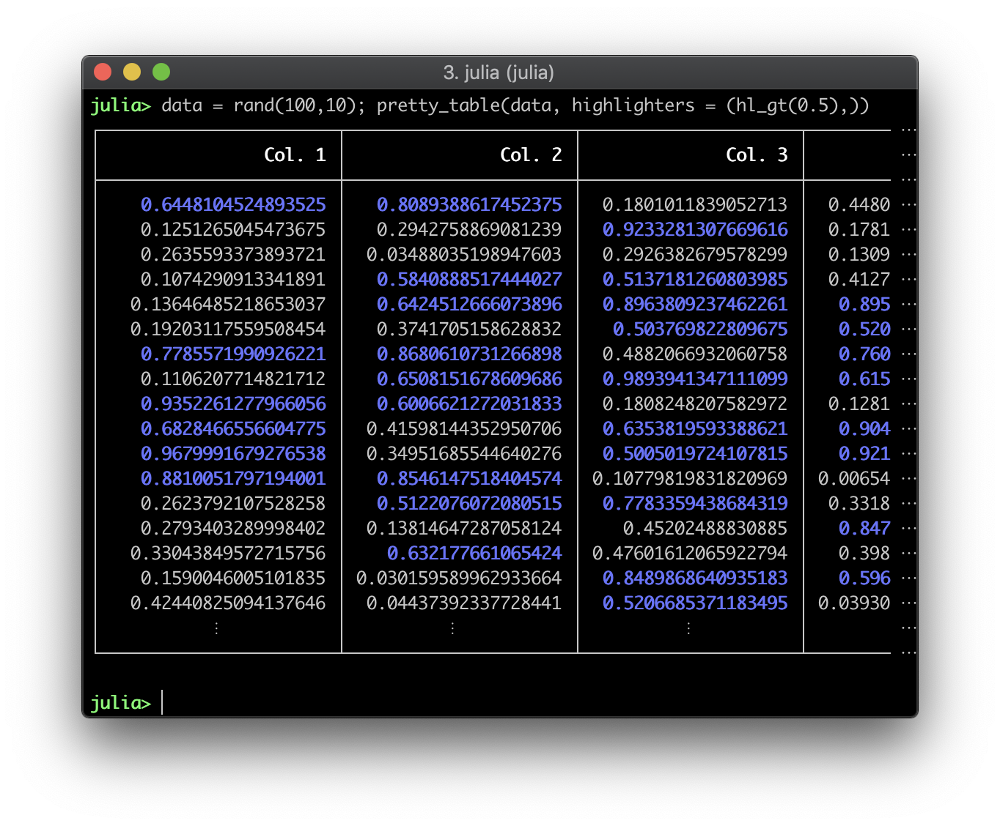
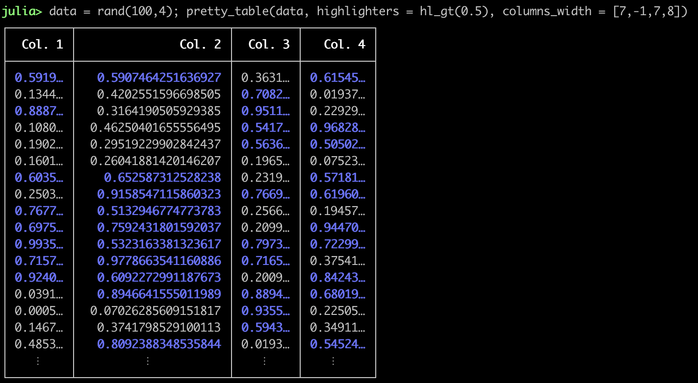
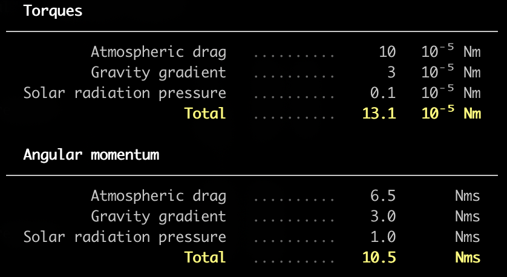

Text back-end examples
======================

```@meta
CurrentModule = PrettyTables
DocTestSetup = quote
    using PrettyTables
end
```

In the following, it is presented how the following matrix can be printed using
the text back-end.

```julia-repl
julia> data = Any[ 1    false      1.0     0x01 ;
                   2     true      2.0     0x02 ;
                   3    false      3.0     0x03 ;
                   4     true      4.0     0x04 ;
                   5    false      5.0     0x05 ;
                   6     true      6.0     0x06 ;]
```




The following example indicates how `highlighters` can be used to highlight the
lowest and highest element in the data considering the columns 1, 3, and 5:


Since this package has support to the API defined by
[Tables.jl](https://github.com/JuliaData/Tables.jl), then many formats, *e.g*
[DataFrames.jl](https://github.com/JuliaData/DataFrames.jl), can be pretty
printed:



You can use `hlines` keyword to divide the table into interesting parts:



If you want to break lines inside the cells, then you can set the keyword
`linebreaks` to `true`. Hence, the characters `\n` will cause a line break
inside the cell.



The keyword `noheader` can be used to suppres the header, which leads to a very
simplistic, compact format.



In the following, it is shown how the filters can be used to print only the even
rows and columns:



By default, if the data is larger than the screen, then it will be cropped to
fit it. This can be changed by using the keywords `crop` and `screen_size`.



You can use the keyword `columns_width` to select the width of each column, so
that the data is cropped to fit the available space.



If you want to save the printed table to a file, you can do:

```julia-repl
julia> open("output.txt", "w") do f
            pretty_table(f,data)
       end
```

This package can also be used to create data reports in text format:

```julia-repl
julia> data = ["Torques" "" "" "";
               "Atmospheric drag" "."^10 10 "10⁻⁵ Nm";
               "Gravity gradient" "."^10 3 "10⁻⁵ Nm";
               "Solar radiation pressure" "."^10 0.1 "10⁻⁵ Nm";
               "Total" "."^10 13.1 "10⁻⁵ Nm";
               "" "" "" ""
               "Angular momentum" "" "" "";
               "Atmospheric drag" "."^10 6.5 "Nms";
               "Gravity gradient" "."^10 3.0 "Nms";
               "Solar radiation pressure" "."^10 1.0 "Nms";
               "Total" "."^10 10.5 "Nms"]

julia> pretty_table(data, borderless;
                    noheader = true,
                    cell_alignment = Dict( (1,1) => :l, (7,1) => :l ),
                    formatter = ft_printf("%10.1f", 2),
                    highlighters = (hl_cell( [(1,1);(7,1)], crayon"bold"),
                                    hl_col(2, crayon"dark_gray"),
                                    hl_row([5,11], crayon"bold yellow")),
                    hlines = [1,7],
                    hlines_format = Tuple('─' for _ = 1:4) )
```


